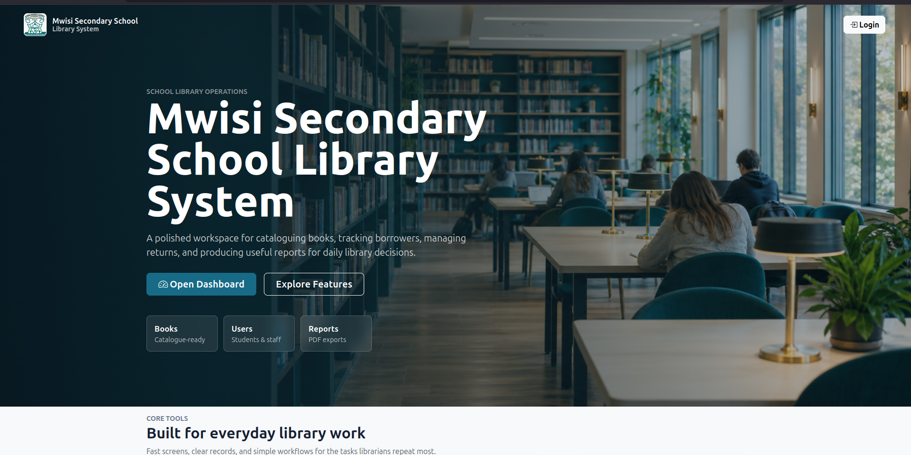
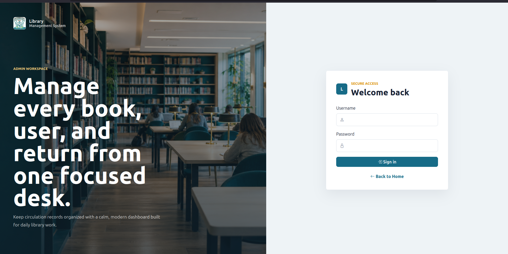
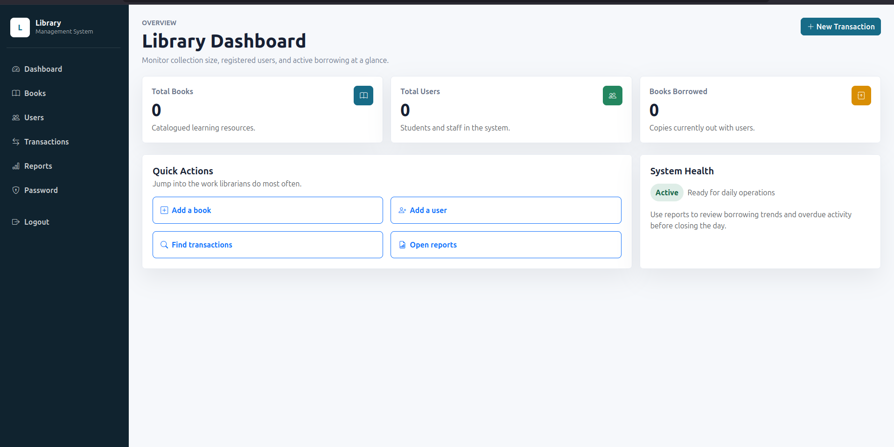
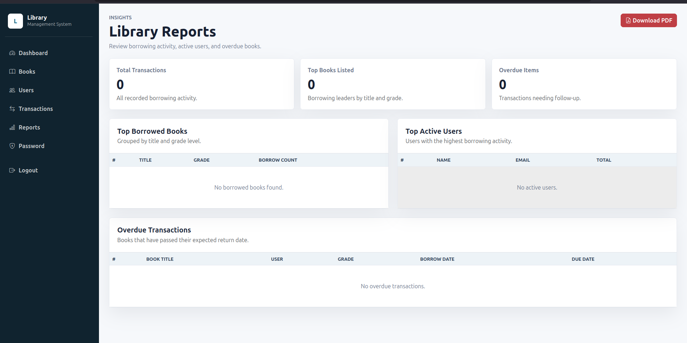

# Library Management System

A Spring Boot MVC web application for managing a school library. The app provides an admin dashboard, book and user management, borrowing transactions, imports from Excel, and downloadable library reports.

## Features

- Admin login and password management
- Dashboard with book, user, and borrowed-book counts
- Book management with create, edit, delete, details, pagination, and Excel import
- User management with create, edit, delete, pagination, and Excel import
- Borrowing transaction management with issue, edit, delete, return, and search flows
- Reports dashboard for top borrowed books, active users, overdue transactions, and total transactions
- PDF report download
- PostgreSQL-backed persistence
- Docker support

## Screenshots

### Home Page



### Login Page



### Dashboard



### Reports



## Tech Stack

- Java 17
- Spring Boot 3.5.3
- Spring MVC
- Spring Data JPA
- Spring Security
- Thymeleaf
- PostgreSQL
- Maven
- Lombok
- iTextPDF
- Apache POI
- Docker

## Prerequisites

Before running the app, install:

- JDK 17
- PostgreSQL
- Maven, or use the included Maven wrapper
- Docker, optional

## Configuration

The application reads database settings from environment variables:

```bash
DB_URL=jdbc:postgresql://localhost:5432/library
DB_USER=your_database_user
DB_PASSWORD=your_database_password
ADMIN_USERNAME=admin
ADMIN_PASSWORD=change_this_password
```

Create a PostgreSQL database first, then make sure these variables are available in the shell or runtime environment where the app starts. `ADMIN_USERNAME` and `ADMIN_PASSWORD` are used only when the first admin account is created.

Configuration lives in `src/main/resources/application.yml`. The tracked file uses environment-variable placeholders instead of real secrets. For local-only values, use environment variables or ignored files such as:

```text
.env
src/main/resources/application-local.yml
```

Use `src/main/resources/application.example.yml` as a safe reference for the expected settings.

By default, the app uses the `local` profile unless `SPRING_PROFILES_ACTIVE` is set. That lets `./mvnw spring-boot:run` load your ignored `src/main/resources/application-local.yml` during local development. In production, set `SPRING_PROFILES_ACTIVE` explicitly and provide secrets through the deployment environment.

The current JPA configuration uses:

```yaml
spring:
  jpa:
    hibernate:
      ddl-auto: update
```

This is convenient during development because Hibernate updates the schema automatically. Review this setting before using the app in production.

## Run Locally

From the project root:

```bash
./mvnw spring-boot:run
```

Then open:

```text
http://localhost:8080
```

## Default Admin Account

On first startup, the app creates a default admin account if no admin exists:

```text
Username: value of ADMIN_USERNAME, or admin if unset
Password: value of ADMIN_PASSWORD, or password if unset
```

Set `ADMIN_PASSWORD` before the first startup in any shared or production-like environment, then change the password after signing in.

## Run Tests

```bash
./mvnw test
```

## Build

```bash
./mvnw clean package
```

The packaged application will be created under `target/`.

## Docker

Build the image:

```bash
docker build -t library-management-system .
```

Run the container:

```bash
docker run -p 8080:8080 \
  -e DB_URL=jdbc:postgresql://host.docker.internal:5432/library \
  -e DB_USER=your_database_user \
  -e DB_PASSWORD=your_database_password \
  library-management-system
```

If PostgreSQL is running somewhere other than the host machine, update `DB_URL` accordingly.

## Main Routes

| Route | Description |
| --- | --- |
| `/` | Public home page |
| `/admin/login` | Admin login page |
| `/admin` | Admin dashboard |
| `/admin/change-password` | Change admin password |
| `/books` | Book list and management |
| `/users` | User list and management |
| `/transactions` | Borrowing transactions |
| `/reports` | Reports dashboard |
| `/reports/download` | Download PDF report |

## Project Structure

```text
src/main/java/com/shacky/library
├── config          Spring Security and startup configuration
├── controllers     Spring MVC controllers
├── dtos            Data transfer objects used by forms and views
├── entities        JPA entities
├── repositories    Spring Data repositories
└── services        Business logic interfaces and implementations

src/main/resources
├── static          Static assets
├── templates       Thymeleaf templates
├── application.yml
└── application.example.yml
```

## Notes

- The app uses PostgreSQL by default.
- Security protects the admin dashboard, books, users, transactions, reports, and admin routes.
- Excel imports are supported through Apache POI.
- PDF reports are generated with iTextPDF.
